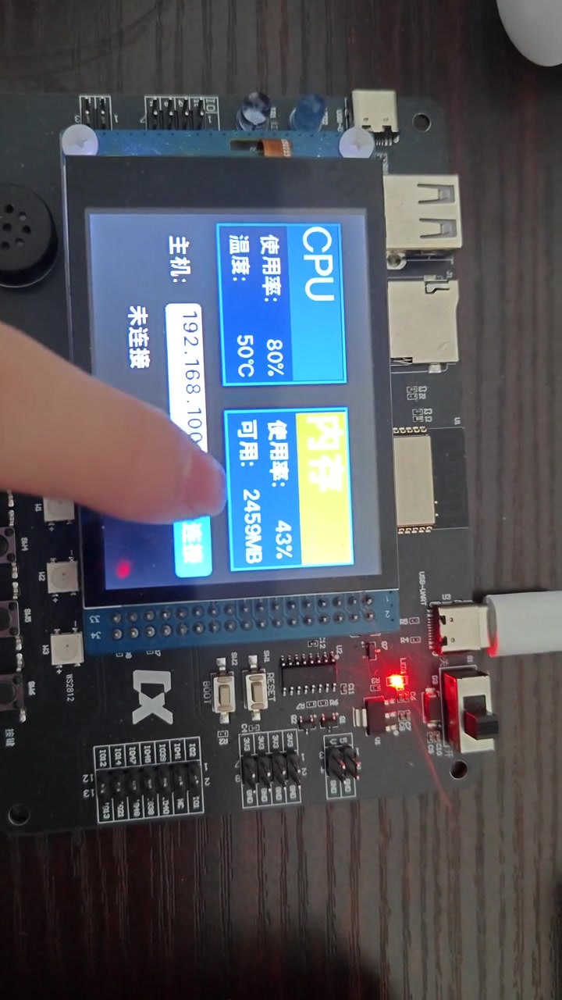
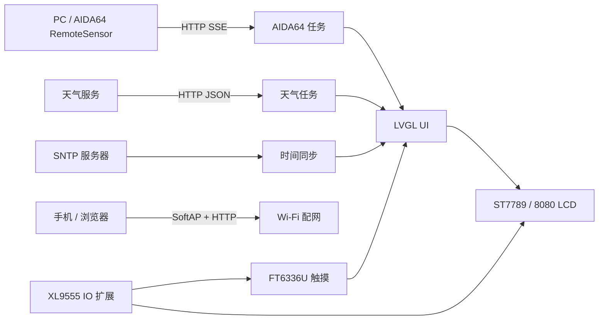

# ESP32-S3 AIDA64 Monitor

基于 ESP32-S3、ESP-IDF 与 LVGL 的桌面信息终端。设备通过 HTTP/SSE 读取 AIDA64 RemoteSensor 数据，同时显示网络时间和天气信息，并支持触摸操作与 Wi-Fi Web 配网。

> A desktop information display built with ESP32-S3 and LVGL. It visualizes AIDA64 PC telemetry, weather, and network time, with touch input and browser-based Wi-Fi provisioning.


## 演示视频

[](docs/media/esp32-s3-monitor-demo.mp4)

点击封面播放 [38 秒项目演示视频](docs/media/esp32-s3-monitor-demo.mp4)，内容包含触摸交互、监控页面和设备运行效果。公开版本已压缩为 720p H.264，并移除手机定位等拍摄元数据。

## 功能

- 通过 HTTP/SSE 获取 CPU 占用率、CPU 温度、内存占用率和已用内存
- 通过 SNTP 同步时间，通过 HTTP + cJSON 获取天气信息
- 长按按键进入 AP 模式，在浏览器中扫描并配置 Wi-Fi
- 使用 LVGL 构建主页、天气页、监控页和触摸交互
- 驱动 320 × 240 ST7789 LCD、FT6336U 触摸屏和 XL9555 IO 扩展芯片

## 系统架构



## 任务与数据流

| 模块 | 作用 | 主要实现 |
| --- | --- | --- |
| UI 与显示 | 页面绘制、触摸输入、屏幕刷新 | `main/lv_port.c`、`main/ui/` |
| AIDA64 | 建立 SSE 连接并解析 PC 监控数据 | `main/aida64.c` |
| 天气 | 请求天气接口并解析 JSON | `main/weather.c` |
| 配网 | SoftAP、热点扫描、HTTP 配网页面和 STA 重连 | `components/ap_wifi/` |
| 板级驱动 | LCD、触摸、IO 扩展和按键 | `components/bsp/` |

## 硬件

| 模块 | 型号 / 说明 |
| --- | --- |
| MCU | ESP32-S3 |
| 显示屏 | 3.5 英寸 320 × 240 ST7789，8080 8-bit 并口 |
| 触摸 | FT6336U，I2C |
| IO 扩展 | XL9555，I2C |
| 网络 | 2.4 GHz Wi-Fi |

## 关键实现

### LVGL 与 8080 LCD

使用 `esp_lcd` 创建 I80 总线和 ST7789 面板，通过 `esp_lvgl_port` 管理 LVGL 任务与锁。触摸坐标经过交换和镜像配置后送入 LVGL 输入设备。

### AIDA64 数据解析

设备根据用户输入的主机 IP 连接 `http://<ip>/sse`，在 HTTP 事件回调中解析 RemoteSensor 数据，再更新监控页面。连接任务由 FreeRTOS Event Group 触发，避免在 UI 操作中阻塞。

### Web 配网与重连

长按实体按键进入 APSTA 模式，内置 HTTP 页面扫描附近热点并提交 SSID/密码。Wi-Fi 事件处理器负责连接状态回调和断线重连。

## 构建与运行

### 环境

- ESP-IDF 5.x
- ESP32-S3 开发板及上述屏幕模组
- AIDA64 Extreme，启用 RemoteSensor

### 编译烧录

```bash
idf.py set-target esp32s3
idf.py menuconfig
idf.py build
idf.py -p COMx flash monitor
```

### AIDA64 设置

1. 在 AIDA64 中打开 `File -> Preferences -> Hardware Monitoring -> LCD`。
2. 启用 `RemoteSensor` 并添加需要展示的传感器项目。
3. 确保 PC 与设备位于同一局域网。
4. 在设备监控页面输入 PC 的局域网 IP 并连接。

## 个人完成内容

- 完成 ESP-IDF 工程集成和 FreeRTOS 任务组织
- 适配 LCD、触摸屏和 IO 扩展芯片
- 完成 LVGL 页面集成、Wi-Fi Web 配网、SNTP 和天气请求
- 实现 AIDA64 SSE 连接、数据解析和页面更新链路

## 当前限制

- 项目按指定 ESP32-S3 屏幕开发板的引脚和外设设计，其他硬件需要修改 BSP
- AIDA64 字段解析依赖当前 RemoteSensor 输出格式
- 仓库尚未记录统一测试条件下的刷新率、启动时间、内存占用和断线重连耗时，因此 README 不提供未经测量的性能数据
- 可复现实测记录仍待补充

## 目录

```text
main/
  main.c              应用入口与系统初始化
  lv_port.c           LCD、触摸与 LVGL 适配
  aida64.c            SSE 连接与数据解析
  weather.c           天气请求与解析
  ui/                 LVGL 页面与资源
components/
  ap_wifi/            Wi-Fi 管理与 Web 配网
  bsp/                板级驱动
html/                 配网页面
img/                  SPIFFS 图片资源
```

## 使用说明

本项目用于嵌入式学习与作品展示。天气服务、AIDA64 和硬件模组可能包含各自的使用条款，请在实际部署时自行确认。
